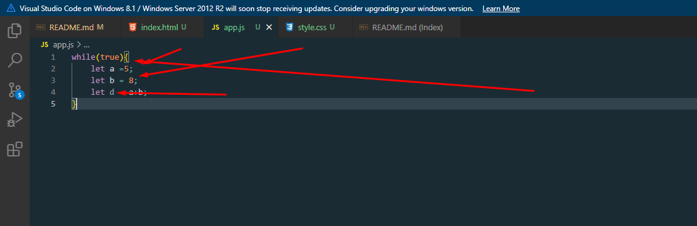
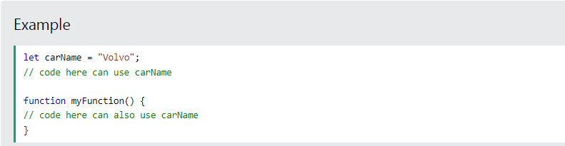

# presintation2
#scope
> Scope determines the accessibility (visibility) of variables.

<h1> JavaScript has 3 types of scope:</h1>

Block scope  
Function scope  
Global scopel  
> Before ES6 (2015), JavaScript had only Global Scope and Function Scope.

ES6 introduced two important new JavaScript keywords: let and const.

These two keywords provide Block Scope in JavaScript.

Variables declared inside a { } block cannot be accessed from outside the block:

> 

>Variables declared with the var keyword can NOT have block scope.

Variables declared inside a { } block can be accessed from outside the block.

> <h1>Function scope:</h1>
JavaScript has function scope: Each function creates a new scope.

Variables defined inside a function are not accessible (visible) from outside the function.

Variables declared with var, let and const are quite similar when declared inside a function.

They all have Function Scope:

><h1>Global Scope </h1>
A variable declared outside a function, becomes GLOBAL.
Global Scope
Variables declared Globally (outside any function) have Global Scope.

Global variables can be accessed from anywhere in a JavaScript program.

Variables declared with var, let and const are quite similar when declared outside a block.

They all have Global Scope:

> Hoisting in java script 

In JavaScript, a variable can be declared after it has been used. 

In other words; a variable can be used before it has been declared.
Hoisting is JavaScript's default behavior of moving all declarations to the top of the current scope (to the top of the current script or the current function). 
The let and const Keywords  
Variables defined with let and const are hoisted to the top of the block, but not initialized. 

Meaning: The block of code is aware of the variable, but it cannot be used until it has been declared. 

Using a let variable before it is declared will result in a ReferenceError. 

The variable is in a "temporal dead zone" from the start of the block until it is declared: 

> JavaScript Hoisting  
In JavaScript, a variable can be declared after it has been used. 

In other words; a variable can be used before it has been declared.
Variables defined with let and const are hoisted to the top of the block, but not initialized.. 

Meaning: The block of code is aware of the variable, but it cannot be used until it has been declared.. 

Using a let variable before it is declared will result in a ReferenceError.. 

The variable is in a "temporal dead zone" from the start of the block until it is declared:. 

hamai тағйирёбанда дар даруни  Function() хамааш local scope meshavad. 

gayr az gunction declaration yagon functiuon nametavonad hoisting shavand; . 
 > <h1>  referenceError</h1>
 

 > RECURSION
 Амали функсияе, ки худро даъват мекунад, рекурсия барои ҳалли мушкилоте истифода мешавад, ки дорои зермасъалаҳои хурдтар мебошанд. Функсияи рекурсивӣ метавонад ду вурудро қабул кунад: ҳолати асосӣ (рекурсияро анҷом медиҳад) ё ҳолати рекурсивӣ (рекурсияро дубора оғоз мекунад).  
 Функсияи рекурсивӣ то он даме, ки шарт иҷро шавад, худро даъват мекунад
Рамзи зерини Python функсияеро муайян мекунад, ки рақамро мегирад, онро чоп мекунад ва сипас худро бо арзиши рақам -1 боз даъват мекунад. Он то он даме, ки адад ба 0 баробар шавад, идома меёбад ва дар ин ҳолат он қатъ мешавад.

> What is closure in JavaScript? 
Closure in JavaScript is a form of lexical scoping used to preserve variables from the outer scope of a function in the inner scope of a function. Lexical scoping is the process used to define the scope of a variable by its position in the source code.
